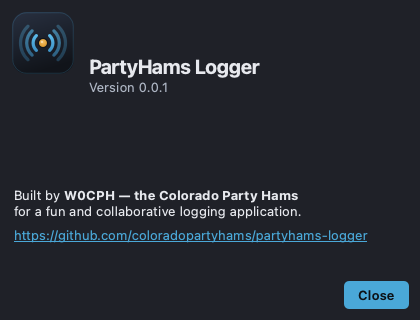

# About

**Help → About PartyHams Logger…** shows the app icon, name and version, a
credit line, and a link to the project repository.

PartyHams Logger is built by **W0CPH — the Colorado Party Hams** as a fun,
collaborative logging application. The dialog re-themes with the rest of the app
and the repository link opens in your browser.

## Limitations

- Purely informational — there are no settings here.
- The version shown is the installed package version.
