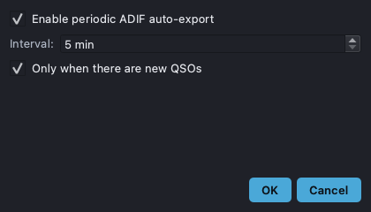

# Auto-export

PartyHams can periodically write an ADIF backup of your log so a crash or power
loss never costs you the contest. Configure it from **Logs → Auto-export…**.

## Settings

- **Enable periodic ADIF auto-export** — turn the feature on or off.
- **Interval (minutes)** — how often to write, clamped to 5–60 minutes.
- **Only if new QSOs** — skip writing when nothing has changed since the last
  export, avoiding redundant files.

Each export writes a timestamped ADIF file so successive backups don't overwrite
one another.

## Manual exports

You can always export on demand from **Logs → Export ADIF…** and
**Logs → Export Cabrillo…** (the latter for contest submission).

## Limitations

- Auto-export writes ADIF only; Cabrillo is manual (submission formats vary by
  contest).
- Files accumulate over a long contest — clean up old timestamped backups
  afterward.
- Exports reflect the active log only; switch logs to back up a different one.
