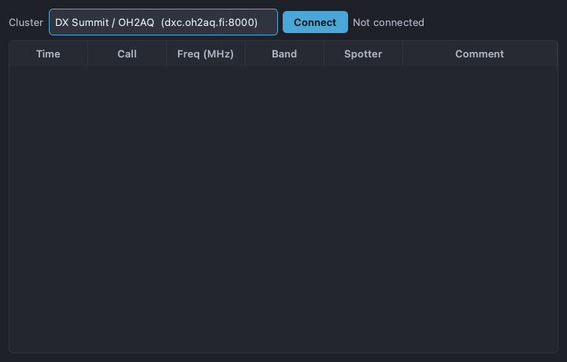

# DX Cluster

Open from **View → DX Cluster…**. Connect to a DX cluster to see spots and,
when a radio is connected, jump the rig to a spot's frequency.

## Connecting

- Pick a cluster from the dropdown (a few common ones are pre-filled), or choose
  **Custom…** and type `host:port`.
- Click **Connect**. The status label shows the connection state. PartyHams logs
  in with your station callsign.

## Working spots

Incoming spots populate the table (DX call, frequency, spotter, comment, time).
Double-click a spot to QSY the connected radio to that frequency.

## Limitations

- The cluster client speaks the common telnet line protocol; exotic cluster
  software or unusual login prompts may not be handled.
- The live connect/spotting path is protocol-tested but **not verified against
  every cluster node** — behavior depends on the node you connect to.
- QSY-on-double-click requires a connected radio with CAT control; otherwise it
  is informational only.
- Spots are not de-duplicated against your log here; use the main window's dupe
  hints when you tune to one.
