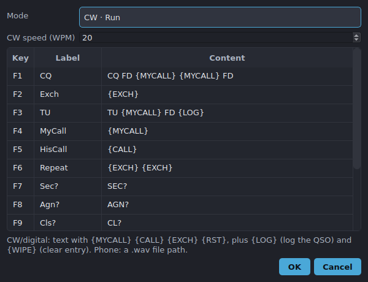

# Macros & ESM

Open the editor from **Macros → Edit Macros…**. Macros are the twelve F-key
messages shown on the bar at the bottom of the main window. They are saved
per contest and split into banks.

## Banks

There is a bank per mode group and Run/S&P state:

- **CW · Run**, **CW · S&P**
- **Phone · Run**, **Phone · S&P**

The active bank follows your current mode and the Run/S&P toggle (Tab on the
main window), so F2 sends the right thing in each context.

## Macro content

- **CW / digital** — plain text with substitutions: `{MYCALL}`, `{CALL}`,
  `{EXCH}`, `{RST}`, plus the actions `{LOG}` (log the QSO) and `{WIPE}`
  (clear the entry row). A **CW speed (WPM)** setting controls sending speed.
- **Phone** — a path to a `.wav` file that is played as your voice message.

## CW WPM presets

In CW mode the speed bar shows quick **WPM preset** buttons (seeded with 24 and
20) between the CW speed box and the live keyboard sender. Click one to jump the
macro speed to that value. **Right-click** a preset to change or delete it, and
use the **+** button to add another. Manage the full list — or turn the whole
feature off — from **Radio → CW WPM Presets…**; with presets disabled the
buttons and the **+** are hidden entirely.

## ESM (Enter Sends Messages)

Toggle **Macros → ESM**. With ESM on, Enter advances through the natural
calling sequence (your call, exchange, TU) instead of just moving between
fields — fewer keystrokes during a run.

## Auto-CQ

**Macros → Auto-CQ** repeats F1 (your CQ) on a timer while you're in Run mode
and haven't started typing a callsign. Set the cadence under **Auto-CQ
Interval** (5–30 s).

## Limitations

- Phone macros need a readable `.wav` file and Qt Multimedia (bundled in
  packaged builds).
- Auto-CQ only fires in Run mode and pauses the moment you start entering a
  call, so it never CQs over a contact in progress.
- Substitution tokens are fixed to the set above.
