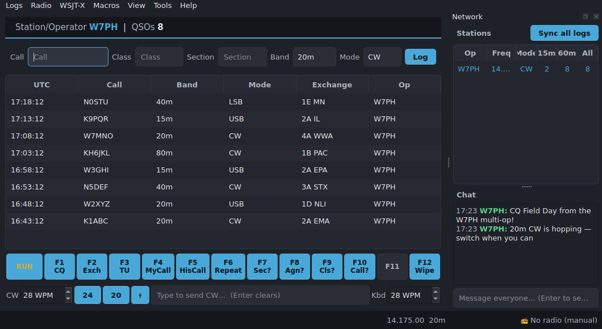

# Main logging window

The main window is where you spend the contest. It is **keyboard-first** and
modeled on N1MM-style entry: type a call, press Enter to advance, and a final
Enter logs the QSO.

## Layout, top to bottom

- **Score bar** — your station call, the contest name, and a live tally:
  QSOs, points, sections (multipliers), power multiplier, and total score.
- **Entry row** — the call field plus exchange fields generated from the
  contest definition, then a **Log (Enter)** button and a dupe / new-multiplier
  badge. Without a radio, manual **Band** and **Mode** pickers appear here; when
  a CAT radio is connected it supplies band/mode/frequency automatically, so
  those pickers are hidden and the data is shown in the status bar instead.
- **Log table** — every QSO in the active log, newest at the top, with columns
  adapted to the contest (e.g. Field Day has no RST columns). **Double-click** a
  row to edit a QSO's details, or **right-click** for Edit / Delete. Edits and
  deletes sync to networked stations like new QSOs do.
- **F-key macro bar** — twelve function-key messages for the current Run/S&P
  bank. It is shown only in **CW, USB, and LSB** (where keyed/voice macros
  apply); in data modes (RTTY, FT8/FT4) and FM/AM the bar is hidden, and when
  WSJT-X is driving a data mode it is replaced by the [WSJT-X panel](wsjtx.md).
- **Status bar** — transmit indicator on the left; on the right the live
  readout (frequency, band, and — with a CAT radio — mode), the WSJT-X transmit
  period (EVEN/ODD) while WSJT-X drives a data mode, and the connected radio (or
  "No radio (manual)"), plus transient messages.
- **Update available** — PartyHams checks GitHub for new releases periodically. If a
  newer version is out, a green **⬇** appears in the status bar; hover to see the
  version and click it to download and install it **in-app** — a progress bar shows
  in the status bar, and the app offers to restart into the new version when ready.
  Tune this in **Tools → Update Settings…**: turn the check on/off (privacy
  opt-out), set how often it runs (1 hour to 7 days), or check right now. **Tools →
  Check for Updates…** also triggers a check on demand. (In-app install applies to
  the packaged app; from a source checkout the build is just downloaded for you.)
- **Network dock** — the [Network panel](network-panel.md) docks on the right.

## Keyboard flow

| Key | Action |
| --- | --- |
| Type in **Call** | Enter the worked station's callsign |
| **Enter** | Advance to the next empty field; on the last field, log the QSO |
| **F1–F12** | Send the corresponding macro |
| **Tab** | Toggle Run / Search & Pounce (changes the macro bank) |

The Call field shows live hints as a tooltip: dupe status, super-check-partial
matches, and (if configured) QRZ lookup results.

## Menus

- **Logs** — New / Open / Open Recent, Export ADIF, Export Cabrillo, Auto-export.
- **Radio** — Select Radio (choose/change the CAT connection).
- **WSJT-X** — enable the UDP listener and set its port.
- **Macros** — edit messages, toggle ESM, Auto-CQ and its interval.
- **View** — Sections Worked, DX Cluster, Theme, Font, and the Network dock toggle.
- **Tools** — QRZ Login, Reference Data imports.
- **Help** — User Guide, Keyboard Shortcuts, About.

## Limitations

- CAT auto-fill follows the rig only while a radio is connected; otherwise band
  and mode are chosen manually.
- The window binds to a single active log at a time; use **Logs → Open** to
  switch (see [Open Log](open-log.md)).
- Voice (phone) macros play `.wav` files and require Qt Multimedia, which is
  bundled in packaged builds.
