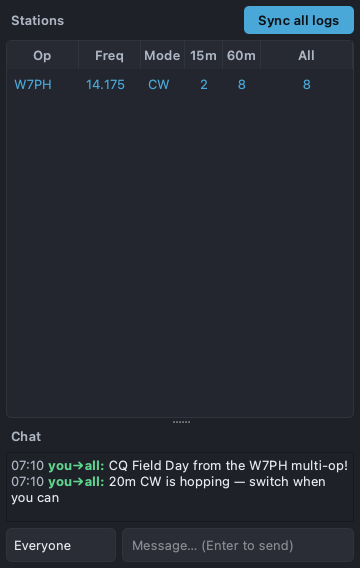

# Network panel

The Network panel docks on the right of the main window (toggle it from the
**View** menu). It shows everyone in your multi-op network and a shared chat.

## Stations roster

The top table lists each station on the network, including yourself:

| Column | Meaning |
| --- | --- |
| **Op** | Operator callsign (a ⏰ marker flags a clocked-detected time drift) |
| **Freq** | The station's current frequency |
| **Mode** | Current mode |
| **15m / 60m** | QSOs logged in the last 15 and 60 minutes (rate) |
| **All** | That station's total QSOs in the shared log |

**Sync all logs** asks every station to send its entire log so each operator
ends up with a complete copy — handy after someone joins late or recovers from
a dropout.

## Per-station drill-down

Click a row to drill into that station's stats: a per-hour histogram, a by-mode
breakdown, and power / SWR / odd-even figures where available. A **Back** button
returns to the roster.

## Chat

The bottom pane is a network chat. Pick a recipient ("Everyone" or a specific
operator) and type a message; press Enter to send. Incoming messages addressed
to you or to everyone appear here.

## Limitations

- The roster only populates when you create the log on a **network** (a
  multicast group). An offline/standalone log shows just your own station — as
  in the screenshot above.
- Peer discovery and chat travel over UDP multicast on your LAN; they will not
  cross routed networks or the open internet without extra plumbing.
- Clock-drift detection is advisory — correct the offending machine's clock for
  accurate dupe/score reconciliation.
