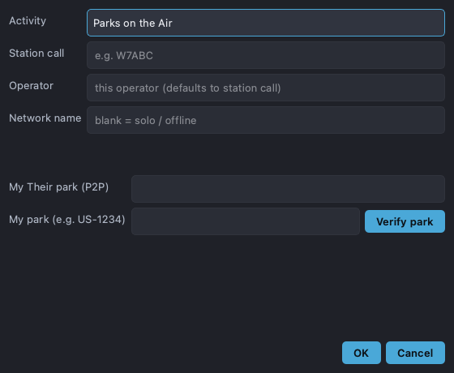

# New Log

Create a new contest log from **Logs → New Log…** (also shown at first launch
when no log is remembered).

## What you set

- **Activity / contest** — picks the contest definition, which in turn decides
  the entry fields, scoring, and section/multiplier rules.
- **Station callsign** — your station call (`my_call`), used in the title bar,
  exports, and as the network identity.
- **Operator** — the operator initials/call for this seat (multi-op logs record
  who made each QSO).
- **Sent exchange** — what you send (e.g. Field Day class and section).
- **Network** — a multicast group name to join other stations, or blank for a
  standalone/offline log. See the [Network panel](network-panel.md).
- **Contest-specific fields** — extra options the contest defines (power, etc.).

Accepting creates a new SQLite log file under your logs directory and opens it.

## Limitations

- The contest list comes from the built-in contest definitions; unsupported
  contests aren't selectable here.
- Network logs require all stations to use the **same** group name on the same
  LAN.
- Station/exchange details are baked into the log at creation; to change them
  significantly, start a new log.
