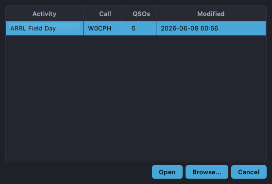

# Open Log

Reopen a previously saved log from **Logs → Open Log…**. The dialog lists every
log file found in your logs directory, newest first, with its contest, station
call, and QSO count.

## Switching logs

Selecting a log and accepting closes the current window and reopens the chosen
log in a fresh window — your radio connection and settings carry over.

For the few logs you bounce between most, **Logs → Open Recent** offers a quick
submenu of the most recent files without opening this dialog.

## Limitations

- Only readable PartyHams log files are listed; foreign or corrupt files are
  skipped silently.
- The currently open log is never shown as a switch target.
- Logs live in the app's logs directory; moving a file out of that directory
  hides it from this list (open it explicitly via Recent if it's remembered).
