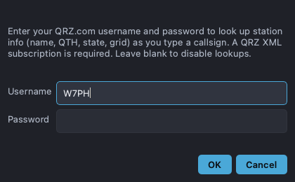

# QRZ.com lookups

Enter your QRZ.com credentials under **Tools → QRZ Login…** to look up station
info (name, QTH, state, grid) live as you type a callsign.

## Setup

- Type your QRZ username and password and accept. Credentials are saved so
  lookups work on the next launch.
- Leave the fields blank to disable lookups entirely.

## How it behaves

- Lookups are **debounced** and run in the background, so typing stays
  responsive.
- Results surface in the status bar / Call-field hints for the call you're
  entering.
- The same call isn't looked up twice in a row.

## Limitations

- A **QRZ XML subscription** is required for full lookup data; without one,
  results are limited or unavailable.
- Lookups need internet access; offline, you simply get no QRZ hints (the
  offline [reference data](reference-data.md) still works).
- The QRZ path is implemented against QRZ's XML API but depends on your account
  and QRZ's availability — treat results as advisory.
