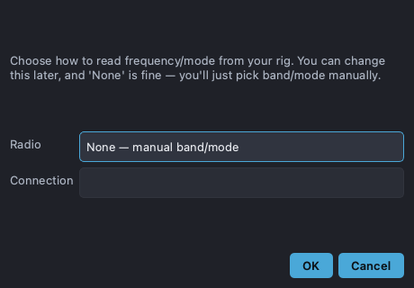

# Radio / CAT

Choose how PartyHams talks to your rig from **Radio → Select Radio…**. With a
radio connected, the entry row's band, mode, and frequency follow the rig
automatically (CAT), and the manual combos become read-only mirrors.

## Supported connections

| Choice | Notes |
| --- | --- |
| **None — manual** | No CAT; pick band/mode yourself. Always works. |
| **Hamlib (rigctld)** | Connect to a running `rigctld` (host:port, default 127.0.0.1:4532). Supports a huge range of rigs. |
| **FlexRadio (native)** | Native SmartSDR TCP protocol; can auto-discover on the LAN. |
| **Icom IC-705 / IC-7610 (CI-V serial)** | Direct CI-V over a serial port. |
| **Icom IC-705 / IC-7610 (LAN / Ethernet)** | Icom's network protocol; needs the radio's IP plus its network username/password. |

Some choices offer a **discover** or **verify** step to confirm the rig is
reachable before you commit.

## Behavior on launch

If a radio was chosen previously it reconnects silently. If the rig isn't
reachable, PartyHams falls back to **manual** mode and notes it in the status
bar rather than blocking startup.

## Limitations

- Only one program can own a serial/CAT port at a time. If you also run WSJT-X,
  see the [WSJT-X page](wsjtx.md) for sharing strategies.
- The Icom LAN, FlexRadio, and Hamlib paths are protocol-tested but depend on
  your specific firmware/network; verify on the air.
- Serial port names differ by OS (`/dev/tty…`, `COM3`, etc.).
