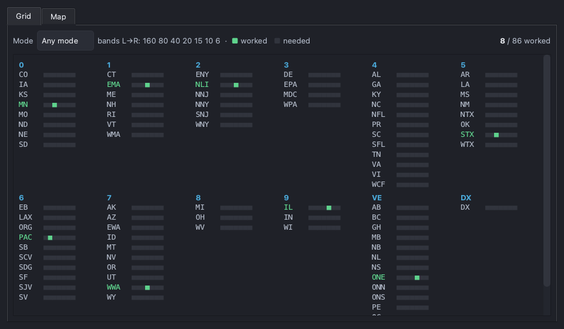

# Sections Worked

Open from **View → Sections Worked…** (shortcut available — see
[Keyboard shortcuts](shortcuts.md)). This window tracks your ARRL/RAC section
multipliers and refreshes live as you log.

## Grid tab

A compact per-band multiplier grid. Sections are grouped by call district.
Each section row shows colored pips, one per band (160 → 6 m, left to right):

- A filled/accent pip means you've worked that section on that band.
- A dim pip means it's still needed there.

The **Mode** selector filters by Any / CW / Phone / Digital. A counter at the
top right shows how many sections you've worked out of the total. Hover a
section name to see exactly which band/mode slots you've completed.

## Map tab

A **schematic** map of North America with clickable section cells. Worked
sections are highlighted; clicking a cell shows its band/mode detail. It is a
quick spatial sense of coverage and where the holes are.

## Limitations

- The Map is a **schematic** layout, not a geographically accurate projection —
  cells are arranged for legibility, not precise location.
- Section tracking uses the contest's multiplier rules; contests without
  section multipliers will show little of interest here.
- The window mirrors the active log only; switching logs rebuilds it.
