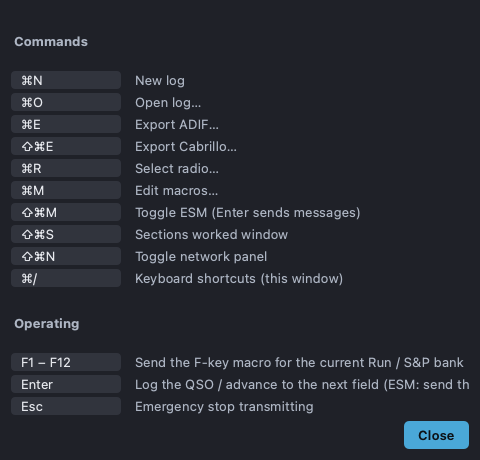

# Keyboard shortcuts

Open the in-app reference from **Help → Keyboard Shortcuts…** (`Ctrl+/`). The
same key specs are assigned to the menu actions, so what you see here always
matches the menus. On macOS, `Ctrl` is shown and used as `⌘`.

## Commands

| Shortcut | Action |
| --- | --- |
| `Ctrl+N` | New log |
| `Ctrl+Shift+O` | Open log… |
| `Ctrl+O` | Set operator (who's at the key) |
| `Ctrl+E` | Export ADIF… |
| `Ctrl+Shift+E` | Export Cabrillo… |
| `Ctrl+R` | Select radio… |
| `Ctrl+M` | Edit macros… |
| `Ctrl+Shift+M` | Toggle ESM (Enter sends messages) |
| `Ctrl+Shift+S` | Sections Worked window |
| `Ctrl+Shift+N` | Toggle network panel |
| `Ctrl+/` | Keyboard shortcuts (this window) |

## Operating keys

| Key | Action |
| --- | --- |
| `F1`–`F12` | Send the F-key macro for the current Run / S&P bank |
| `Enter` | Log the QSO / advance to the next field (ESM: send the next message) |
| `Esc` | Emergency stop transmitting |
| `Tab` | Toggle Run / Search & Pounce |

## Limitations

- Shortcuts are fixed (not user-remappable in-app).
- F-key behavior depends on the active macro bank — see [Macros & ESM](macros.md).
