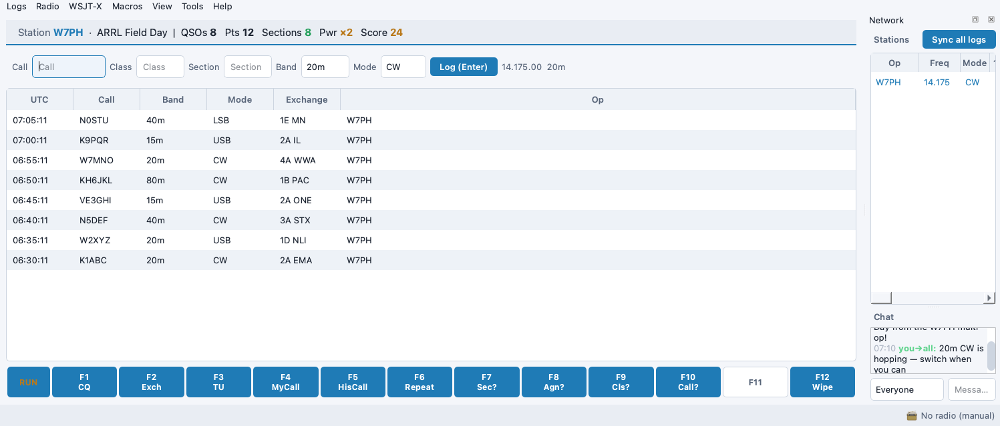

# Themes & fonts

PartyHams ships with several color themes (dark and light) and a configurable
base font, both under the **View** menu. Your choice is saved and restored on
the next launch.

## Themes

**View → Theme** lists the available palettes, divided into dark and light
groups. The default follows your operating system's dark/light setting. Picking
a theme restyles every open window live — no restart needed.

Here is the main window in a light theme:

## Font

**View → Font…** opens the standard font chooser. The chosen family and size
become the app's base font; the UI rescales accordingly. This is useful for
high-DPI displays or operating at a distance from the screen during a contest.

## Limitations

- Themes set colors and the base font size; they don't relayout windows beyond
  what the font change implies.
- The schematic section map and the F-key bar use accent colors from the active
  theme, so very low-contrast custom expectations aren't configurable per
  element — pick a built-in palette that reads well for you.
- Font changes apply app-wide; there is no per-window font override.
