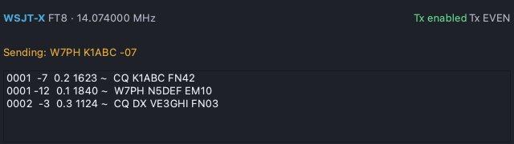

# WSJT-X (FT8 / FT4 and other data modes)

PartyHams can listen to [WSJT-X](https://wsjt.sourceforge.io/) over UDP and log
your digital-mode QSOs automatically. Enable it from the **WSJT-X** menu and set
the UDP port (default 2237) to match WSJT-X's *Reporting → UDP Server*.

## The WSJT-X panel

While WSJT-X is in a data mode, the function-key macro bar is meaningless
(WSJT-X does the transmitting), so it is hidden and replaced by the compact
panel shown above:

- Current mode and dial frequency.
- Transmit state (Tx off / Tx enabled / TRANSMITTING).
- The odd/even Tx period.
- What you're currently sending.
- A rolling list of recent decodes.

## What it does

- **Auto-logs WSJT-X QSOs** — when you log a contact in WSJT-X it is entered into
  the active PartyHams log and broadcast to your networked stations.
- **Reads band/mode from Status messages** — enough to log correctly even when
  WSJT-X owns the CAT port.
- **Highlights wanted stations** *(best-effort)* — asks WSJT-X to color callsigns
  whose section you still need.

## Limitations

- The UDP path was developed and unit-tested against hand-built datagrams
  matching the documented protocol, but **has not been verified against a live
  WSJT-X instance**. Please report what you see on the air.
- In-WSJT-X callsign highlighting depends on WSJT-X's "Accept UDP requests"
  setting and is best-effort.
- WSJT-X and PartyHams cannot both own the same serial/CAT port — see the
  sharing strategies in the radio notes.

## Full setup notes

A longer setup walkthrough (CAT sharing arrangements, split operation, PTT)
lives in [docs/WSJTX.md](../WSJTX.md).
